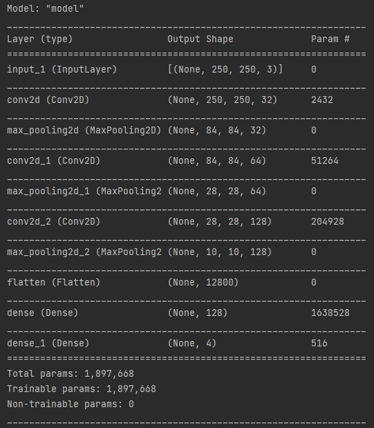
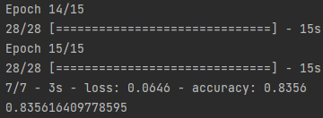
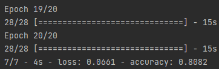
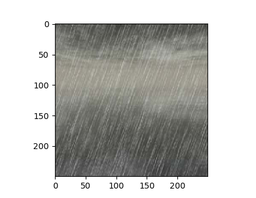
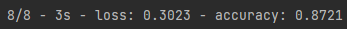

**Machine Learning**

Assignment Report 3

학 번 : 2016722077

이 름 : 성 원 진

학 과 : 컴퓨터정보공학부

과제 설명

-   이번 과제는 CNN(Convolutional Neural Network)를 이용하여 이미지의 Class를 분류하는 Classifier를 만드는 것이다. 주어진 Dataset은 4가지의 날씨에 대한 사진이 들어있는 Dataset이고, Dataset을 이용하여 CNN을 학습시켜 새로운 Data를 주었을 때 그 사진에 대한 정확한 Class를 찾는 것을 목표로 한다.

배경 지식 및 네트워크 구조

-   CNN(Convolutional Neural Network)

    CNN은 Convolution(합성곱) 연산을 이용하여 Data를 처리하고 신경망을 학습시키는 Neural Network 모델이다. CNN을 쓰는 이유는 일반적으로 예를 들면 이미지를 처리하고자 할 때 주어진 이미지를 그대로 학습시킨다면 학습 효율이나 정확성이 떨어질 것이고, 그에 따른 손실이 많이 발생하기 때문에 이미지의 특징(Feature)을 Convolution 연산을 이용한 Feature Extraction을 진행하여 Image의 특성만이 보존된 Latent Vector를 만들어 신경망을 학습시키는 것이다.

    Convolution 연산은 보통 Kernal 또는 Filter라고 하는 N x M 크기의 Matrix를 이용해서 이미지를 처음부터 끝까지 겹치며 훑으면서 Filter와 겹치는 부분의 원소 값을 곱해서 모두 더한 값을 출력으로 하는 연산이다. 이 때 Filter는 보통 3x3, 5x5 size를 주로 사용한다.

    이를 사용하는 예시로는 Sobel Filter가 있는데 Sobel Filter는 보통 Image의 Edge를 검출하기 위해서 사용한다. Filter에는 이미지 검출을 위한 특정 값이 들어있고, Filter와 Image의 Convolution을 이용해서 이미지의 Edge의 Feature Map을 검출할 수 있다.

|   |   |   |
|---|---|---|
|   |   |   |
|   |   |   |

|   |   |   |   |   |
|---|---|---|---|---|
|   |   |   |   |   |
|   |   |   |   |   |
|   |   |   |   |   |
|   |   |   |   |   |

|   |   |   |
|---|---|---|
|   |   |   |
|   |   |   |

보통 Convolution은 Convolutional Neural Network(CNN)에서 Convolutional Layer에서 주로 사용되며 위에서 설명한 Filter를 통해 여러 픽셀들의 Convolution연산을 통해 영상의 특징을 추출하는 곳에 사용된다. CNN에서는 Convolution 연산을 통해 도출된 Feature map을 Subsampling을 반복하여 Pooling Layer에 집어넣는다. Pooling layer에서는 이미지의 Feature Map을 축소하면서 이미지의 품질은 떨어지지만 하나의 픽셀로부터 형태를 분석하기에 좋은 형태로 값을 추출하고, 이미지를 분류하는 Fully Connected Layer에 집어넣어 이미지를 분류하게 된다.

-   Pooling

    Pooling 연산은 CNN에서 Convolution연산을 이용하여 만들어진 결과물의 size를 줄이는 역할을 한다. convolution연산을 하여 나온 모든 Feature를 이용하여 다음 연산을 하면 연산량이 많아지기 때문에 이를 줄이기 위하여 Pooling연산을 진행하는데, Pooling은 Average pooling, Max pooling, Min pooling의 3가지 연산을 주로 이용한다. 보통 (x, y)크기를 기본 단위로 하고, 예를 들어 (2, 2) 크기를 이용하여 Pooling 연산을 한다면, 2x2크기 내에 있는 픽셀 중 Max Pooling이라면 가장 큰 값, Min Pooling이라면 가장 작은 값 하나만 Feature에 남기는 것이다. 어떠한 픽셀이 있다면 그 주변의 값은 비슷할 것이기 때문에 이 중 가장 중요한 값만 남기는 연산이다. Feature의 크기를 줄일 수 있다는 점에서 Subsampling이라고도 한다.

    아래를 예로 들면 왼쪽의 matrix를 2x2 크기의 max pooling 연산을 한다고 했을 때 연산의 결과는 오른쪽과 같이 나오게 된다

| 1 | 4 | 2 | 6 |
|---|---|---|---|
| 8 | 2 | 4 | 3 |
| 4 | 3 | 2 | 4 |
| 4 | 8 | 2 | 1 |

| 8 | 6 |
|---|---|
| 8 | 4 |

위의 연산에서 파란 테두리로 되어있는 부분을 살펴보면 가장 큰 값은 8이다. 이 때 Max pooling을 한다면 가장 큰 값인 8만 남겨두는 연산이 될 것이다. 위의 연산과 같이 pooling을 진행했을 때 이미지의 Size가 줄어들고 그에 따른 연산양이 줄어들게 된다.

-   네트워크 구조

    과제를 통하여 설계한 네트워크의 구조도는 다음과 같다.

    모델의 구조도에 대하여 설명하자면 Feature Extraction부분에서는 3번의 convolution-pooling연산을 진행하고, Flatten하여 parameter를 flat하게 만든 후 이를 128 dimmention으로 만든다. 그 후 이를 4개의 결과로 예측하여 어떠한 값으로 추정되는지 구분한 후 softmax activation하여 원하는 값만 얻게 된다.

    model의 parameter에 대한 세부 값은 다음과 같다.

    세부 파라미터 값을 보면 알 수 있듯이 Flatten layer이전에는 위에서 본 Convolution 연산과 pooling연산이 반복적으로 진행되며 data의 Feature Extraction을 진행한 것을 알 수 있다. 그 이후에는 Fully Connected Layer라는 Layer를 거쳐 원하는 결과값(Label)을 예측하게 되는데 이 때 모든 parameter가 서로 연결되어 있어 Fully connected layer라고 한다. 마지막 Layer에서는 어떤 Feature가 있으면 어떤 결과가 나오는지를 예측하게 된다.

    파라미터 값 아래의 그림을 보면 0이라는 결과가 나오기 위해서 A, C, E라는 파라미터의 강도가 강해야 할 것이고, 1 이라는 결과가 나오기 위해서는 B, C, E 파라미터의 강도가 강해야 할 것이다. 이러한 부분들을 Training Dataset를 통하여 학습/최적화 하고, Validation Dataset을 통하여 처음 보는 Data에 대한 Model의 적응도를 평가한다. Model의 Accuracy는 Train Dataset에 대한 Accuracy 뿐 아니라 Validation Dataset에 대한 Accuracy도 평가하여야 한다.

-   Regularization

    Regularization은 Dataset의 정규화를 의미한다. 어떤 Dataset의 data의 밝기 값이 너무 크다면 너무 큰 수를 이용하여 네트워크가 작동할 것이다. 이를 해결하기 위해서는 Data들을 표준화 하여야 한다. Data값을 정규분포를 따른다고 가정하고 정규화 하는 것이다.

-   Activation Function

    Activation Function은 이전 layer의 결과 값을 변환하여 다른 층의 뉴런으로 신호를 전달하는 역할을 한다. 입력 신호의 총합이 활성화를 일으키는지 정하는 역할을 하고 실제로 여러가지 Activation Function이 쓰인다. 여러가지 Activation Function이 있지만 마지막 Layer을 제외한 Layer에서 ReLU Function을 사용하는 데에는 이유가 있는데 그 중 가장 큰 이유가 Vanishing Gradient Problem이다. 대표적으로 Sigmoid Function같은 경우에는 입력이 큰 경우에는 큰 값을, 입력이 작은 경우에는 작은 값을 출력하는데 Sigmoid function을 계속 사용하다 보면 그 기울기가 소실되는 Vanishing Gradient Problem이 발생하게 된다. 이는 뉴런을 학습시키는 가중치를 작게 만들고, 점점 학습이 느려지는 문제가 발생하게 되는 문제를 말하며, 이를 대체하기 위해 사용되는 함수가 ReLU 함수이다. ReLU 함수는 입력이 0 이하면 0을, 0 보다 크면 자기 자신의 값을 출력하는 함수로서 Sigmoid보다 가중치를 Update하는 속도가 빠르고, 양의 값에 대해서는 Vanishing Gradient Problem이 발생하지 않기 때문에 주로 사용되는 함수이다.

-   Softmax

    마지막 Layer에서는 Softmax function을 Activation Function을 사용하였는데 Softmax function은 one hot vector를 사용하여 예측값이 어떤 class에 가까운지 확실하게 표현하기 위해 사용된다. 이번 과제에서는 4가지의 class로 예측을 진행하였는데 이 때 one hot vector로 표현 할 수 있는 경우도 4가지로 각각 (1, 0, 0, 0), (0, 1, 0, 0), (0, 0, 1, 0), (0, 0, 0, 1) 이렇게 4가지 방법으로 표현되고 예측 값을 이러한 방식으로 인코딩하여 내보낸다.

-   Epoch

    epoch는 전체 Dataset이 모델에 학습된 횟수이다. Model을 fitting하는데에 있어 epoch횟수도 정확도에 중요하게 작용하는데 일반적으로 횟수를 늘릴수록 적합한 파라미터를 찾아가는 확률이 올라가지만, 너무 늘리게 될 경우 모델이 데이터에 Overfitting되는 문제가 발생하게 된다. Overfitting될 경우에 Dataset에 없는 다른 데이터들이 들어올 경우에 대한 예측값에 문제가 생길 수도 있고, 실제 validation dataset에 대한 예측 확률도 낮아진다. 따라서 데이터셋에 맞춘 적합한 epoch수를 찾아야 한다. 나는 이번 과제를 진행하며 여러 경우의 수를 테스트 해보았지만 15회 이상이 될 경우에는 validation data에 대한 정확도가 낮아지는 것을 확인하여 epoch수는 15회로 하였다.

-   Batch size/iteration

    Batch size는 한번의 연산(가중치 업데이트) 에 들어가게 되는 데이터의 크기를 나타낸다. 1개의 batch에 들어가는 Data의 수를 Mini Batch라고 한다. Batch size 또한 학습 속도에 영향을 미치게 되는데 Batch 사이즈가 큰 경우에는 한번에 많은 데이터를 처리해야 하여 학습 속도가 느려지고 가중치 업데이트가 잘 일어나지 않는 점이 발생할 수 있고, 너무 작은 경우에는 너무 잦은 가중치 업데이트로 인하여 훈련이 불안정해질 가능성이 있다.

    Iteration은 batch size와도 관련이 있는데 Batch size만큼의 훈련을 몇 번 반복할 것인가에 대한 것이 iteration이다. 각 batch마다 한번씩 parameter의 가중치가 update되므로, 가중치의 update횟수라고도 볼 수 있다. 따라서 사용자는 적절하게 Batch size와 iteration을 정하여 학습을 진행해야 한다. 과제를 진행하면서 사용한 mini batch는 30, iteration은 30을 사용하여 학습을 진행하였다.

-   Accuracy

    과제를 진행하며 얻은 몇 번의 학습 및 실행 결과이다.

    [0. 0. 0. 1.] / sunshine [0. 1. 0. 0.] / rainy

이외에도 몇가지 validation data외에도 test data를 넣어 결과가 정상적으로 나오는지 확인해 보았으며 모델의 정확도는 약 84\~87%가 도출되었다.

고찰.

-   이번 과제를 진행하며 CNN에 대하여 Train/Validation data loading, Batch size 결정, Model 정의 및 학습, 결과에 대한 최적화를 하는 법을 스스로 학습할 수 있었다. 개인적으로 조금 어려웠던 부분은 input과 input에 대한 data split, output을 plt에 표시하는 것이였고, 다른 부분은 다른 강의에서도 해보았고 학습을 계속 진행하다 보니 익숙해졌던 것 같다. 사실 너무 많은 parameter들이 정확도에 영향을 미쳐서 어떤 parameter를 조정해주어야 조금 더 정확한 예측이 가능한 지 하나하나 바꾸어 가며 조금이라도 더 정확한 결과를 내놓는 방향으로 조정하는 재미가 있었던 것 같고, 처음에는 잘 학습이 되지 않았지만 조정 결과 조금 더 나은 정확도를 얻을 수 있었다.
